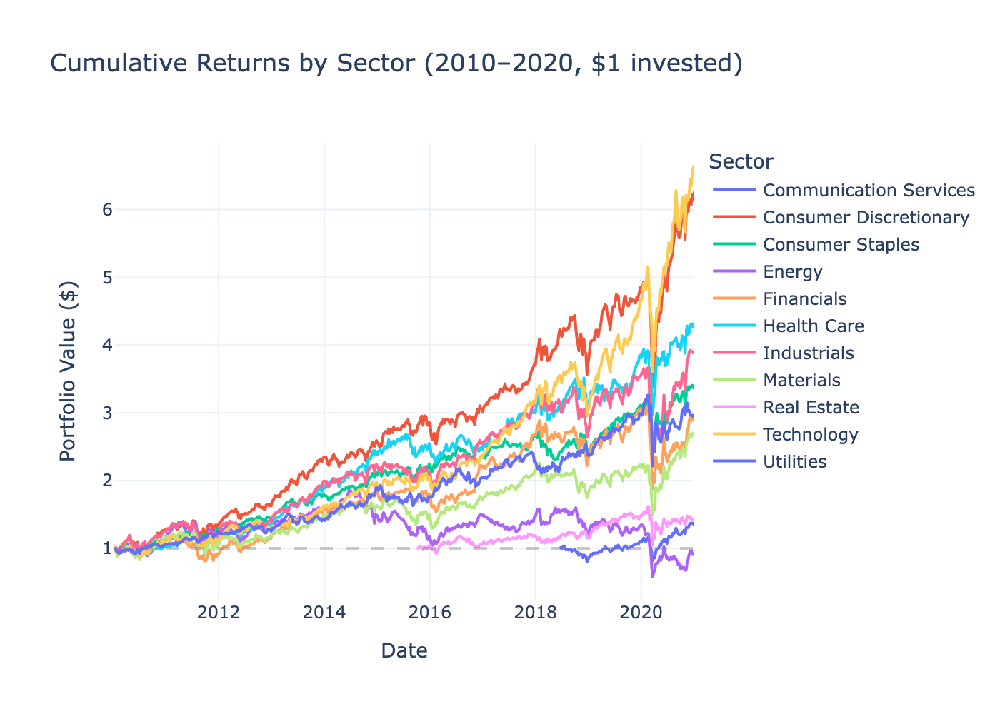
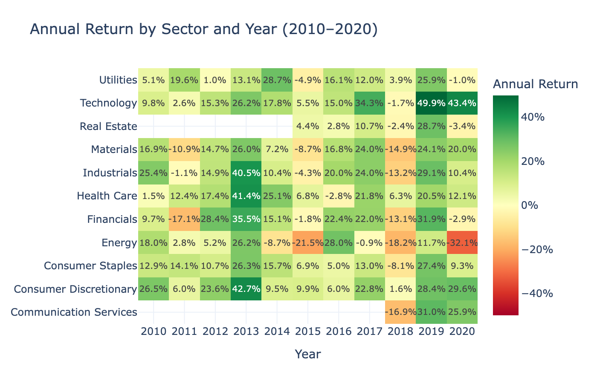
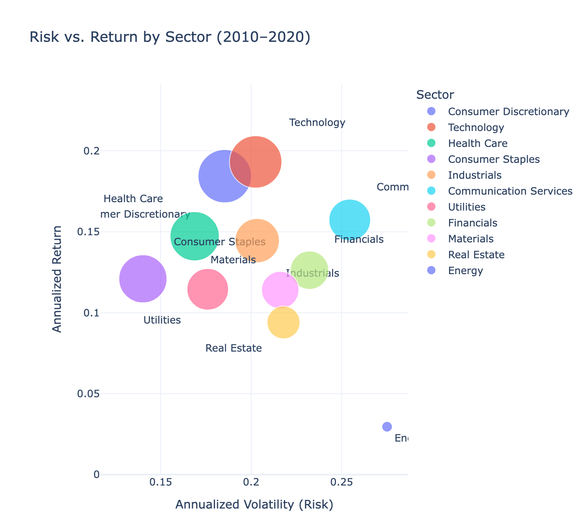
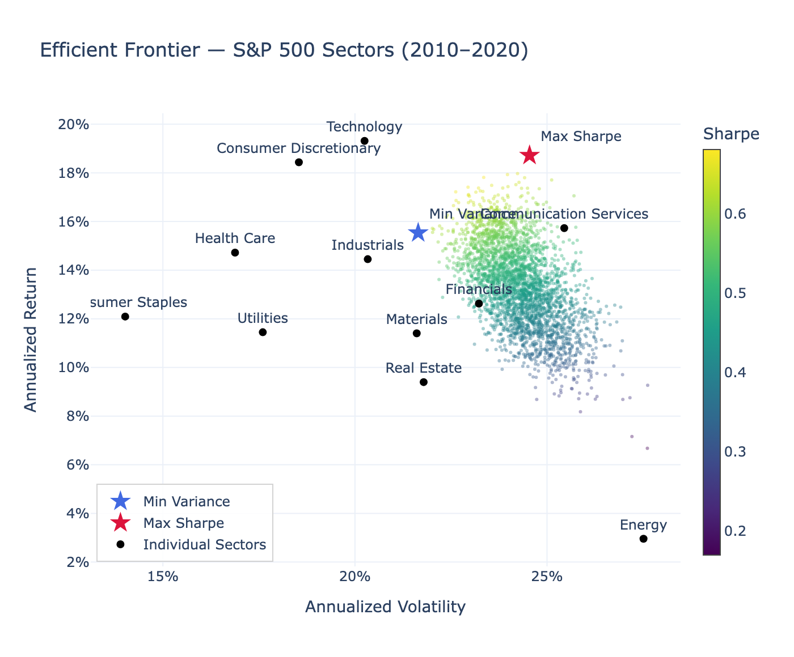

# sp500-sector-analysis

S&P 500 sector analysis (2010–2020): risk-return profiling across 11 GICS sectors using Python, pandas, SQL, Plotly, and Tableau.

## Features

- **Data pipeline** — downloads adjusted close prices via yfinance, computes daily returns, stores in SQLite
- **Risk-return metrics** — annualized return, volatility, Sharpe ratio, max drawdown, beta and alpha vs SPY
- **7 interactive charts** — cumulative returns, annual heatmap, risk-return scatter, correlation matrix, rolling Sharpe, efficient frontier
- **Dash dashboard** — all charts in a tabbed web app (`python app.py`)
- **Jupyter notebook** — end-to-end narrative walkthrough with styled metrics table
- **Tableau exports** — daily returns and metrics summary as CSVs
- **SQL queries** — window functions, rolling averages, sector rankings
- **Test suite** — 12 pytest tests covering metrics and data loading

## Project Structure

```
sp500-sector-analysis/
├── src/
│   ├── data_loader.py      # download prices, compute returns, save/load from SQLite
│   ├── metrics.py          # Sharpe, drawdown, rolling Sharpe, efficient frontier, SPY benchmark
│   └── visualizations.py   # 9 Plotly chart functions + Tableau CSV export
├── sql/
│   ├── schema.sql
│   └── queries/
│       ├── sector_returns.sql    # annual return per sector
│       ├── risk_metrics.sql      # annualized volatility per sector
│       └── window_functions.sql  # LAG, RANK, rolling avg
├── notebooks/
│   └── analysis.ipynb      # end-to-end walkthrough with all charts
├── tests/
│   ├── test_metrics.py
│   └── test_data_loader.py
├── output/
│   ├── charts/             # saved HTML charts
│   └── tableau/            # CSV exports
├── app.py                  # Dash dashboard
├── main.py                 # CLI pipeline
└── requirements.txt
```

## Quickstart

```bash
pip install -r requirements.txt

# Full pipeline: download → metrics → charts → export
python main.py

# Or run individual steps
python main.py --download          # fetch data and populate SQLite
python main.py --metrics           # print metrics table
python main.py --charts            # save HTML charts to output/charts/
python main.py --export            # export CSVs for Tableau
python main.py --test              # run pytest suite
python main.py --dashboard         # launch interactive Dash app
```

## Metrics

| Metric | Description |
|--------|-------------|
| Annualized Return | Compounded daily return × 252 |
| Annualized Volatility | Std dev of daily return × √252 |
| Sharpe Ratio | Risk-adjusted return (risk-free rate = 2%) |
| Max Drawdown | Largest peak-to-trough decline |
| Beta | Sensitivity to SPY (S&P 500 benchmark) |
| Alpha | Excess return above CAPM expectation |
| Rolling Sharpe | Trailing 252-day Sharpe, 21-day smoothed |

## Dashboard

```bash
python app.py
# open http://localhost:8050
```

Four tabs: Risk-Return Overview · Rolling Sharpe · Efficient Frontier · Correlation Matrix

## Data Source

11 GICS sector ETFs (XLB, XLC, XLE, XLF, XLI, XLK, XLP, XLRE, XLU, XLV, XLY) via `yfinance`.  
Note: XLC launched June 2018 and XLRE launched October 2015 — their charts begin from those dates.

---

## Results

### Cumulative Returns (2010–2020, $1 invested)



Technology and Consumer Discretionary were the standout performers — a $1 investment in Technology in 2010 grew to over $6 by end of 2020, driven by the sustained bull run in mega-cap tech. Energy was the only sector to end the decade roughly flat, weighed down by the 2015–2016 oil price crash and the 2020 demand collapse. The March 2020 COVID crash is visible as a sharp dip across all sectors, followed by a rapid recovery — with Technology and Consumer Discretionary rebounding to new highs fastest.

### Year-by-Year Returns



No single sector dominated every year, but Technology posted positive returns in 9 of 11 years. Energy stands out as the most volatile — alternating between strong gains and deep losses year to year. 2018 was broadly negative (Fed rate hikes, trade war concerns), while 2019 was the mirror image with nearly every sector posting double-digit gains. The heatmap makes clear that diversifying across sectors would have smoothed returns significantly compared to holding any single sector.

### Risk vs. Return



Bubble size represents Sharpe ratio. Sectors in the upper-left are most desirable — high return, low risk. Technology and Consumer Discretionary achieved the highest returns but at above-average volatility. Health Care offered a compelling risk-adjusted trade-off: strong returns with relatively low volatility, giving it one of the highest Sharpe ratios. Energy sits in the lower-right — the worst of both worlds, with high volatility and low return over the period. Consumer Staples and Utilities cluster in the lower-left as classic defensive sectors: modest returns but the lowest volatility.

### Efficient Frontier



Each dot represents a randomly weighted portfolio of the 11 sectors, colored by Sharpe ratio (yellow = best). The cloud's upper-left edge is the efficient frontier — portfolios with the highest return for a given level of risk. The **max-Sharpe portfolio** (red star) concentrates heavily in Technology and Health Care, achieving a significantly better risk-adjusted return than any individual sector. The **min-variance portfolio** (blue star) tilts toward Consumer Staples and Utilities. Notably, all individual sectors (black dots) fall inside the frontier, confirming that diversification across sectors always improves the risk-return trade-off compared to holding a single sector.
